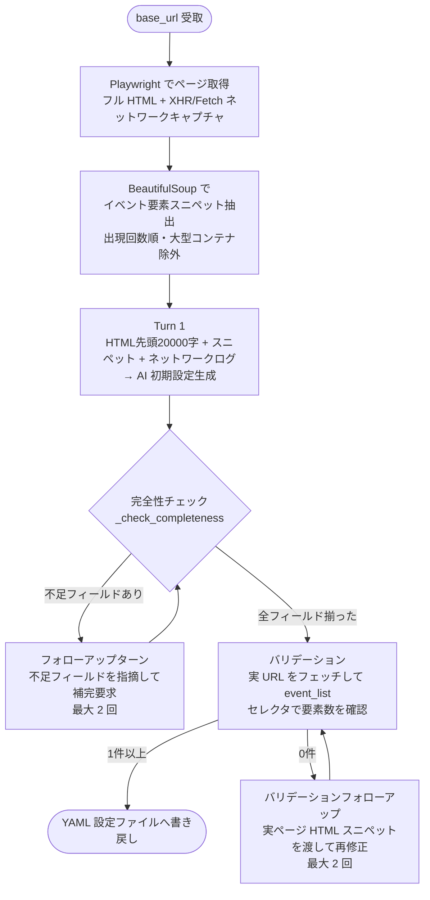
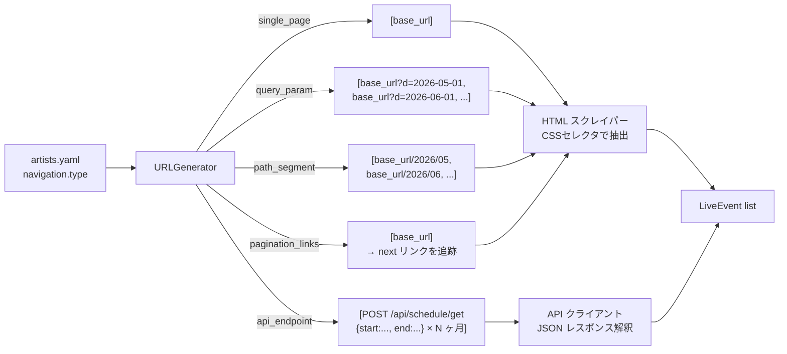
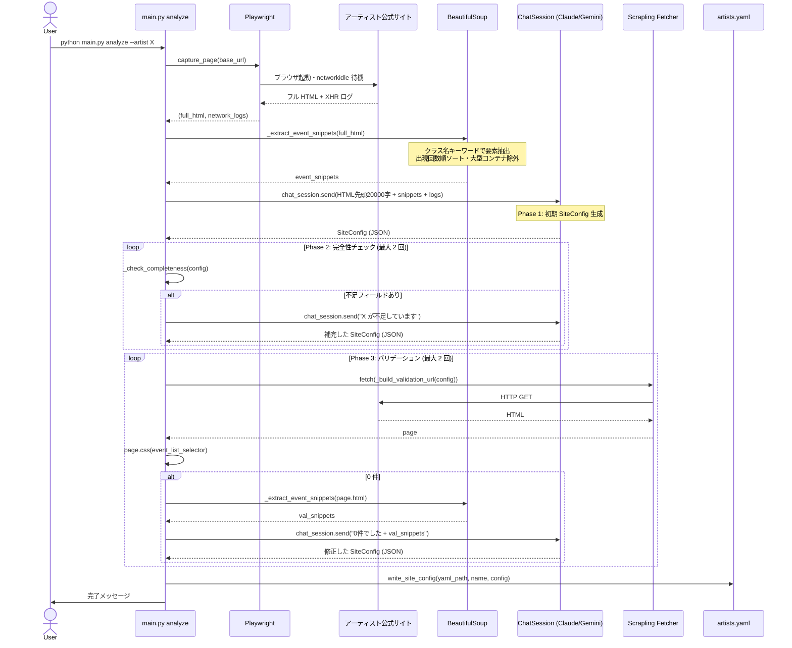
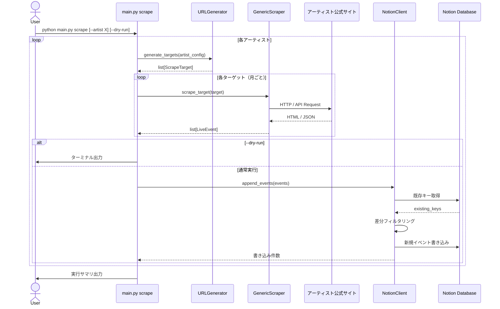

# アーキテクチャ図 — idol-live-tracker

## 1. 全体像（スクレイピング ＆ Web フロントエンド）

本システムは、情報収集を行う **CLI バッチ層** と、収集した情報を表示する **Web フロントエンド層** の 2 つで構成されます。

```mermaid
flowchart LR
    subgraph BatchLayer["CLI バッチ層 (Python)"]
        A1[analyze コマンド\n設定自動生成]
        S1[scrape コマンド\n情報収集]
        N1[Notion/Discord\n同期・通知]
        A1 -->|設定| S1
        S1 -->|保存| DB[(SQLite: events.db)]
        S1 -->|同期| N1
    end

    subgraph WebLayer["Web フロントエンド層"]
        API[FastAPI\nREST API]
        UI[React SPA\n(Vite/TanStack/shadcn)]
        DB -->|JSON提供| API
        API -->|Fetch| UI
        UI -->|閲覧| User((ユーザー))
    end
```

---

## 2. Navigation タイプ判定フロー（analyze フェーズ）



詳細な設計・工夫点は [analyze-loop-design.md](./analyze-loop-design.md) を参照。

---

## 3. Navigation タイプ別 URL/リクエスト生成（scrape フェーズ）



---

## 4. シーケンス図 — analyze コマンド（3 フェーズ自己修正ループ）



---

## 5. シーケンス図 — scrape コマンド



---

## 6. ディレクトリ構造

```
idol-live-tracker/
├── docs/
│   ├── requirements.md           ← 要件定義書
│   ├── basic-design.md           ← 基本設計書
│   ├── architecture.md           ← 本ファイル（アーキテクチャ図）
│   └── discord-summary-format.md ← 週次サマリーフォーマット仕様
├── src/
│   ├── ai/
│   │   ├── __init__.py
│   │   └── provider.py           ← AIProvider ABC + ClaudeProvider + GeminiProvider
│   ├── analyzer/
│   │   ├── __init__.py
│   │   ├── site_analyzer.py      ← AI サイト解析（HTML + ネットワークキャプチャ）
│   │   └── config_writer.py      ← 解析結果を YAML へ書き戻す
│   ├── enricher/
│   │   ├── __init__.py
│   │   └── enricher.py           ← チケットサイト検索 + AI 補完（opt-in）
│   ├── models/
│   │   ├── __init__.py
│   │   └── event.py              ← LiveEvent dataclass
│   ├── notion/
│   │   ├── __init__.py
│   │   └── client.py             ← NotionClient（差分 upsert）
│   ├── notifier/
│   │   ├── __init__.py
│   │   ├── discord.py            ← イベント単位 Discord 通知
│   │   └── weekly_summary.py     ← 週次サマリー送信
│   ├── scrapers/
│   │   ├── __init__.py
│   │   ├── base.py               ← BaseScraper (ABC)
│   │   ├── url_generator.py      ← navigation config → URL/リクエスト生成
│   │   └── generic.py            ← GenericScraper（全 Navigation タイプ対応）
│   ├── store/
│   │   ├── __init__.py
│   │   └── local_store.py        ← SQLite イベントキャッシュ
│   ├── config.py                 ← load_config(), ArtistConfig, AppConfig
│   └── main.py                   ← CLI エントリーポイント（analyze/scrape/enrich/summary）
├── config/
│   └── artists.yaml              ← base_url のみ記載して analyze で自動補完
├── data/                         ← events.db（.gitignore 対象）
├── logs/                         ← 実行ログ（.gitignore 対象）
├── .env.example
└── pyproject.toml
```

---

## 7. 技術スタック

| レイヤー | 採用技術 | 理由 |
|---|---|---|
| サイト解析 | Claude API (claude-sonnet-4-6) | HTML + ネットワークログから構造を推論 |
| スクレイピング（静的） | Scrapling Fetcher | 軽量・TLS フィンガープリント偽装 |
| スクレイピング（動的） | Scrapling DynamicFetcher | Playwright ベース、JS レンダリング対応 |
| Notion 連携 | notion-client (公式 SDK) | 公式サポート、型安全 |
| 設定管理 | PyYAML + python-dotenv | 設定とシークレットを分離 |
| 実行言語 | Python 3.10+ | Scrapling / match 文の最低要件 |
