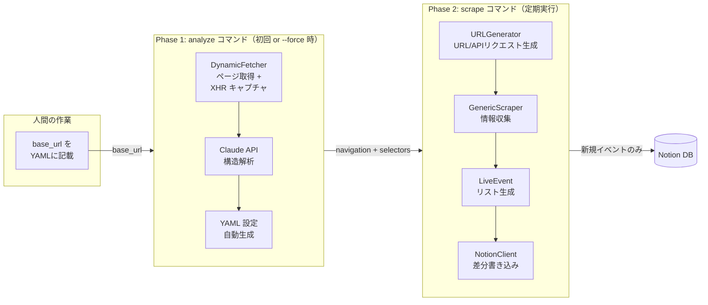
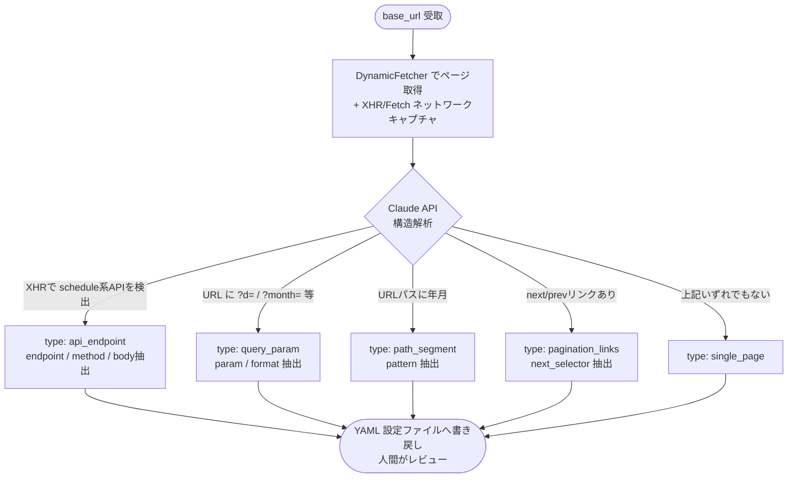
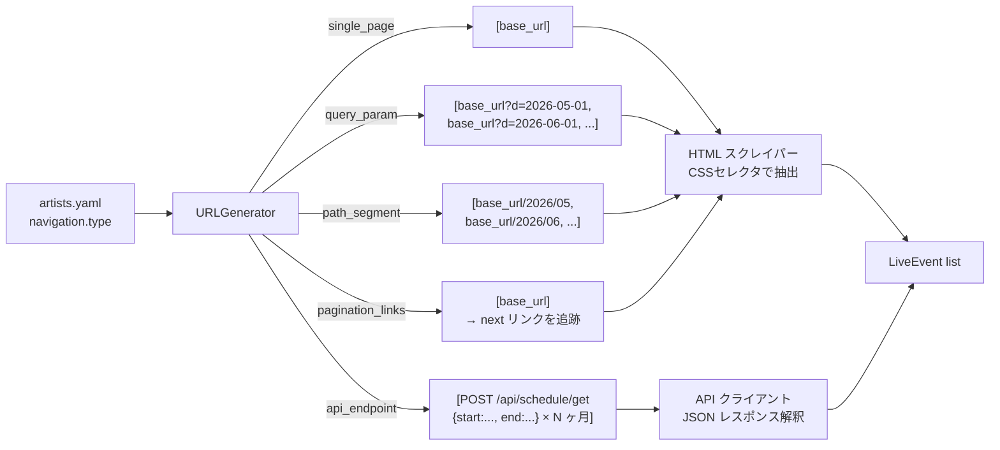
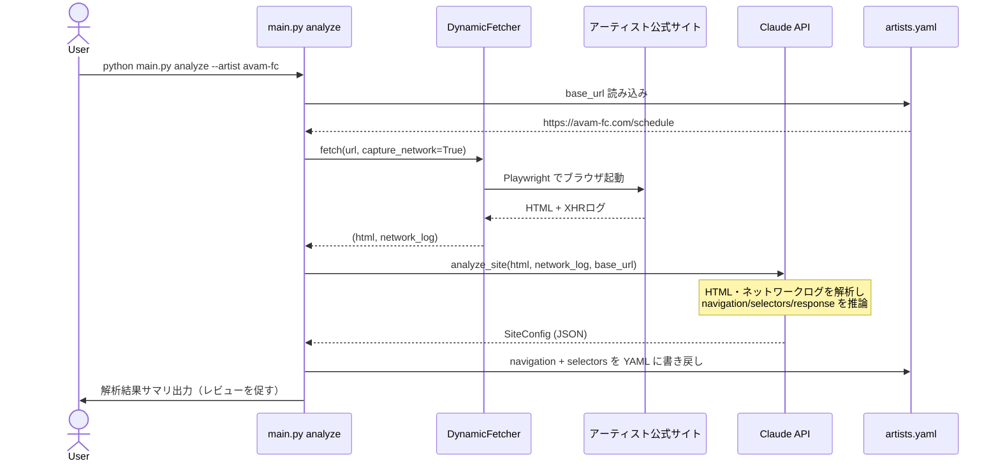
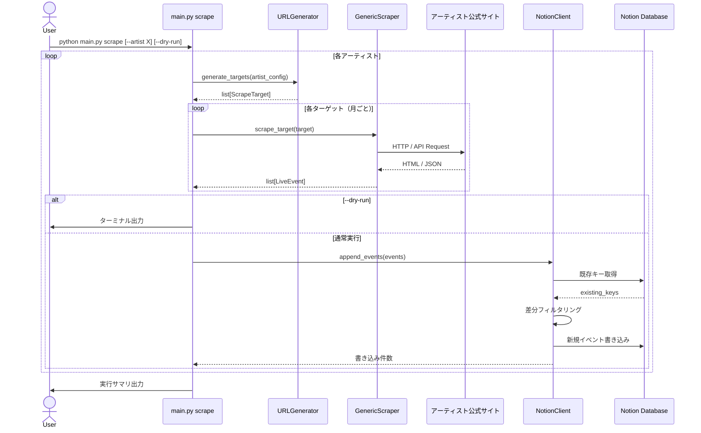

# アーキテクチャ図 — idol-live-tracker

## 1. 2 フェーズ構成の全体像

本ツールは **analyze（解析）** と **scrape（収集）** の 2 フェーズで動作する。
人間は `base_url` のみを指定すればよく、サイト構造の調査・設定生成は AI が行う。



---

## 2. Navigation タイプ判定フロー（analyze フェーズ）



---

## 3. Navigation タイプ別 URL/リクエスト生成（scrape フェーズ）



---

## 4. シーケンス図 — analyze コマンド



---

## 5. シーケンス図 — scrape コマンド



---

## 6. ディレクトリ構造

```
idol-live-tracker/
├── docs/
│   ├── requirements.md      ← 要件定義書
│   ├── basic-design.md      ← 基本設計書
│   └── architecture.md      ← 本ファイル（アーキテクチャ図）
├── src/
│   ├── analyzer/
│   │   ├── __init__.py
│   │   ├── site_analyzer.py ← AI サイト解析（Claude API）
│   │   └── config_writer.py ← 解析結果を YAML へ書き戻す
│   ├── scrapers/
│   │   ├── __init__.py
│   │   ├── base.py          ← BaseScraper (ABC)
│   │   ├── url_generator.py ← navigation config → URL/リクエスト生成
│   │   └── generic.py       ← GenericScraper
│   ├── notion/
│   │   ├── __init__.py
│   │   └── client.py        ← NotionClient
│   ├── models/
│   │   ├── __init__.py
│   │   └── event.py         ← LiveEvent dataclass
│   └── main.py              ← CLI エントリーポイント
├── config/
│   └── artists.yaml         ← base_url のみ記載して analyze で自動補完
├── .env.example
└── pyproject.toml
```

---

## 7. 技術スタック

| レイヤー | 採用技術 | 理由 |
|---|---|---|
| サイト解析 | Claude API (claude-sonnet-4-6) | HTML + ネットワークログから構造を推論 |
| スクレイピング（静的） | Scrapling Fetcher | 軽量・TLS フィンガープリント偽装 |
| スクレイピング（動的） | Scrapling DynamicFetcher | Playwright ベース、JS レンダリング対応 |
| Notion 連携 | notion-client (公式 SDK) | 公式サポート、型安全 |
| 設定管理 | PyYAML + python-dotenv | 設定とシークレットを分離 |
| 実行言語 | Python 3.10+ | Scrapling / match 文の最低要件 |
