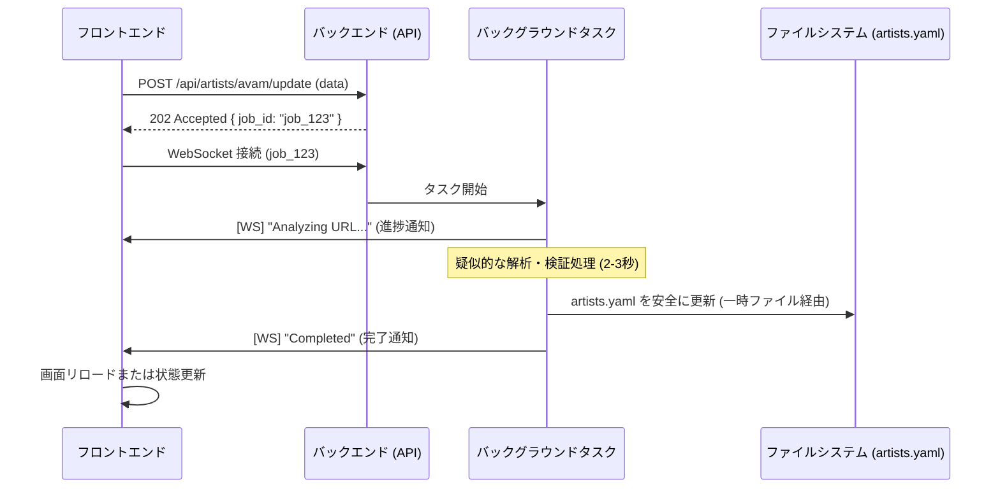

# アーティスト情報更新ワークフロー設計 (非同期 & WebSocket)

アーティスト情報（表示名、テーマカラー、画像URL）をフロントエンドから安全かつ直感的に更新するための設計ドキュメントです。

## 1. 概要
ユーザーが管理画面からアーティスト情報を変更した際、バックエンドで非同期に処理を実行し、その進捗を WebSocket を通じてリアルタイムにフィードバックします。

## 2. アーキテクチャ

### バックエンド (FastAPI)
- **更新リクエスト API**: `POST /api/artists/{name}/update`
  - `display_name`, `theme_color`, `image_url` を受け取る。
  - ジョブ ID を即座に返却し、バックグラウンドタスクを開始。
- **WebSocket エンドポイント**: `ws/api/ws/jobs/{job_id}`
  - 特定のジョブの進捗状況をプッシュ通知。
- **ジョブマネージャー**:
  - メモリ上でジョブのステータスと WebSocket 接続を管理。

### フロントエンド (React)
- **編集フォーム**:
  - **name (ID)**: システム内部で利用する識別子。半角英数字（小文字推奨）で入力してもらうようガイドを表示。 (例: `jj`, `avam`)
  - **display_name (表示名)**: サイト上で表示される正式名称。任意の文字列。 (例: `Juice=Juice`)
  - **theme_color (テーマカラー)**: サイトのアクセント色。カラーピッカーによる直感的な選択に加え、カラーコード（Hex形式）を直接入力・編集できるようにする。
  - **base_url (基本URL)**: アーティストのスケジュールページのURL。 (例: `https://example.com/schedule`)
  - 保存ボタン押下後に WebSocket 接続を確立し、進捗ダイアログを表示。
- **進捗表示**:
  - 例: 「Analyzing [Artist Name]'s URL...」といったメッセージを表示してユーザーを安心させる。

## 3. 処理フロー

## 4. データの永続化 (Kubernetes)
本番環境での「設定の消失」を防ぐため、以下の構成をとります。

- **PVC マウント**:
  - `artists.yaml` を `live-tracker-data` (PVC) 内の特定のパスに配置。
  - コンテナ起動時に `/app/config/artists.yaml` としてマウント、またはシンボリックリンクで参照。
- **ドリフト対策**:
  - 管理画面に「最新の設定をダウンロード」ボタンを設置。本番で変更された YAML を開発環境へ書き戻せるようにする。

## 5. ユーザー体験 (UX) のポイント
- **進捗メッセージ**: 単なるローディングアイコンではなく、「URLを解析中...」などの具体的なアクションを表示することで、システムが動作している確信を与えます。
- **カラーピッカー**: カラーコードの手入力を排除し、視覚的にブランドカラーを選択できるようにします。
